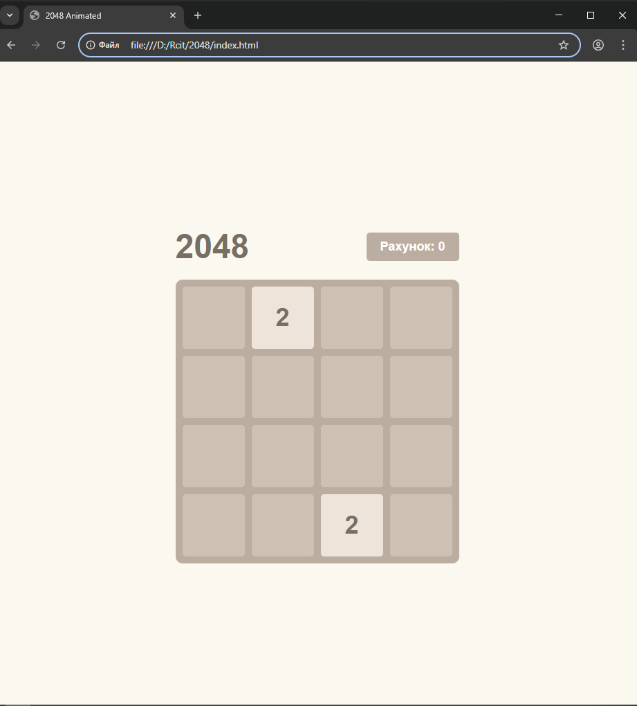
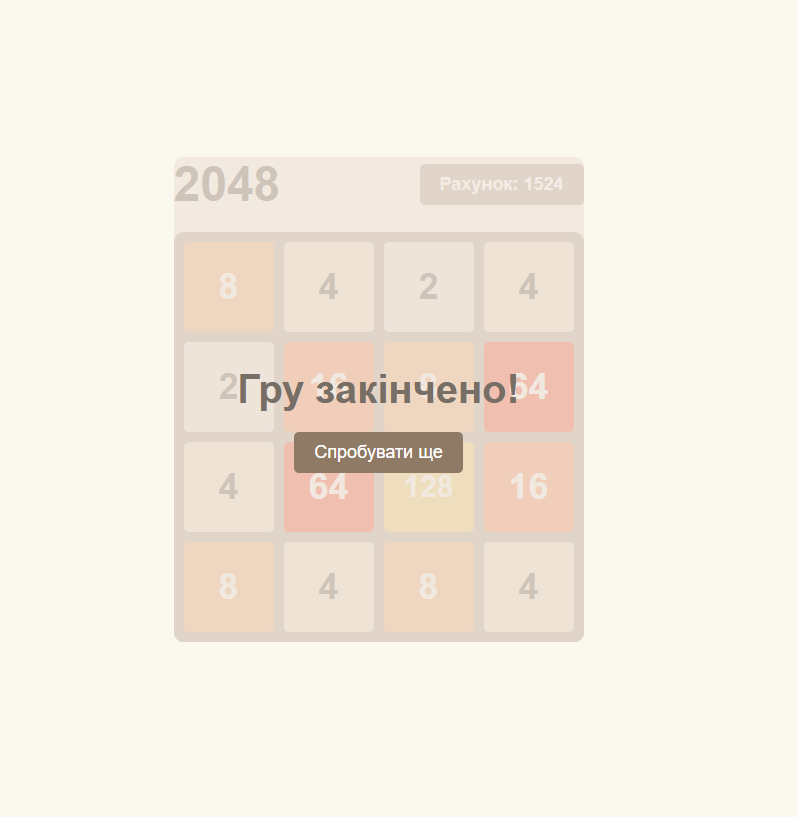

# Навчальна практика з WEB програмування: Фінальний проєкт

## Обрана тема 10. Гра 2048. Класична логічна гра, реалізована на JavaScript. Реалізація логіки виграшу/програшу, підрахунок ходів чи балів.

## 1. Структура документа (index.html)

    Було створено стандартний HTML файл з кодом розмітки сторінки. 

    В ньому реалізовано кодування для Української мови, додано поля виводу інформації, такі як: назва гри, рахунок та кнопку для рестрата. 

    Для забезпечення плавної роботи ігрове поле розділене на два шари: статичну фонову сітку (#grid-bg), яка містить 16 порожніх клітинок, та прозорий контейнер (#tile-container), у якому динамічно створюються та переміщуються активні ігрові плитки

## 2. Стилізація та візуальні ефекти (style.css)
    Було створено файл, що відповідає за зовнішній вигляд гри. 

    Для вирівнювання елементів інтерфейсу використовується Flexbox, а фонова дошка побудована за допомогою CSS Grid. 

    Кожній плитці залежно від її номіналу задається відповідний колір фону. 

    Для реалізації плавної анімації ходів використовується абсолютне позиціонування ігрових плиток.

    Їх переміщення по екрану відбувається завдяки зміні координат через функцію transform, а плавність руху забезпечується transition.

## 3. Логіка застосунку (script.js)    

### initGame()

    Очищує ігровий контейнер у DOM від старих елементів.

    Скидає двовимірний масив board до початкового стану (матриця 4x4, заповнена null).

    Обнуляє score, знімає  стани (hasLost, isAnimating).
    
    Двічі викликає addRandomTile() для генерації перших двох кубиків на старті.

### updateScore()

    Оновлює текстовий вміст HTML-елемента scoreElement актуальним значенням змінної score.

### addRandomTile()

    Проходить по матриці board і збирає координати всіх комірок зі значенням null (порожніх).

    Якщо є вільні місця, рандомно обирає одне з них.

    Генерує значення 2 (з імовірністю 90%) або 4 (10%).

    Створює новий елемент div, візуально розміщує його на полі через setTilePosition() і зберігає посилання на цей елемент разом із його значенням у масив board.

### setTilePosition(element, row, col)

    Відповідає за позиціонування DOM-елемента.

    Приймає елемент та його індекси в матриці. Обчислює позицію в пікселях (множить індекс на 100px — розмір клітинки + відступ) і задає CSS-властивість transform: translate(...).

### slideAndMerge(line)

    Реалізує базову математику гри 2048 для одного одновимірного масиву (рядка чи стовпця).

    Видаляє всі null (зсуває елементи в один бік).

    Ітерує масив: якщо два сусідні елементи мають однакове значення, множить перше на 2, додає результат до score, а другий елемент записує в масив toRemove (сміттєвий кошик для DOM-елементів, які будуть видалені після анімації злиття).

    Доповнює залишок масиву значеннями null до довжини 4 і повертає оновлену лінію та список елементів на видалення.

### move(direction)

    Головний контролер ходу.

    Перевіряє блокіратори: якщо активна анімація (isAnimating) або гра закінчена (hasLost), перериває виконання.

    Залежно від переданого напрямку (Left, Right, Up, Down), збирає відповідні рядки або стовпці з матриці board і пропускає їх через slideAndMerge().

    Обчислює нові координати для елементів і викликає setTilePosition() для старту CSS-анімації руху.

    Встановлює блокування isAnimating = true і запускає setTimeout на 150мс.

    Після завершення таймера (коли CSS-анімація відпрацювала): видаляє з DOM старі елементи зі списку toRemove, оновлює класи/цифри тих, що злилися, генерує новий кубик, знімає блокування та викликає checkGameOver().

### checkGameOver()

    Сканує матрицю. Якщо знаходить значення 2048 — викликає перемогу.

    Якщо є хоча б один null — гра триває (виходить з функції).

    Якщо поле повне, перевіряє сусідні комірки по горизонталі та вертикалі на наявність однакових значень. Якщо є можливість злиття — гра триває.

    Якщо жодна умова вище не виконується, встановлює hasLost = true і викликає екран програшу.

### showGameOver(text)

    Відображає прихований HTML-контейнер (оверлей) з переданим текстом результату гри.

    document.addEventListener('keydown', ...)

    Слухач подій клавіатури. Перехоплює натискання стрілок і викликає метод move() з відповідним текстовим аргументом напрямку.

# Скріншоти роботи застосунку

# Висновок

    Під час виконання практичного завдання було успішно реалізовано повноцінний інтерактивний вебзастосунок - класичну логічну гру «2048». Розробка проєкту дозволила на практиці застосувати та поглибити знання базового стека вебтехнологій (HTML, CSS та JavaScript) без використання сторонніх бібліотек.
    У процесі створення гри було відпрацьовано  ключові навички вебпрограмування. Зокрема, закріплено розуміння роботи з двовимірними масивами (матрицями) для збереження стану ігрового поля та реалізації математичної логіки зсуву і злиття плиток.
    Також було засвоєно принципи обробки користувацьких подій на прикладі перехоплення натискань клавіш клавіатури. 
    У результаті розроблено повністю працездатний застосунок із коректним підрахунком балів та алгоритмами перевірки умов перемоги або поразки, що цілком відповідає поставленим вимогам завдання.